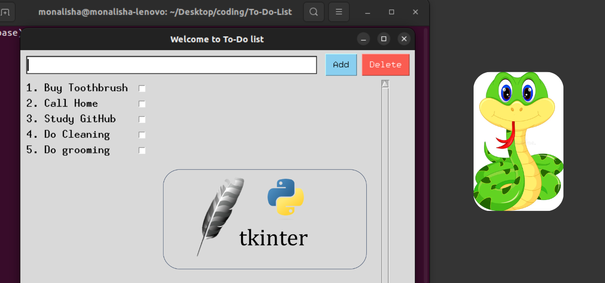

# To Do List App Using Python Tkinter
Hi, I am new to python and aspire to be a python developer. I am taking a 100 day python learning challenge, where I will be learning from basics to advanced concepts. Along with various tools such as Jupyter Notebook, VS Code, GitHub etc.

Check out my detailed article [Building A To-Do-List App With Python Tkinter](https://medium.com/@monalisha1/building-my-first-to-do-list-app-with-tkinter-python-f2078afe5df4) where code is explained step by step.

 

To Do List App using Tkinter is my first step at learning GUI (Graphical User Interface). Following are the learning objectives:

 - Understand GUI ( Graphical user Interface )
 - Python Libraries For GUI Development
 - Tkinter Basics
 - Window Management
 - Widgets
 - Events

Follow me on Medium and I am super active on LinkedIn. Do send a conenction request if you would like to expand your network.
